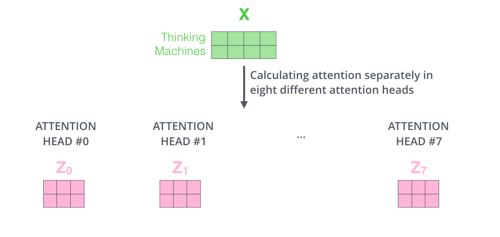

# 图解 Transformer 原理
## 全局视角

首先将 Transformer 视为一个黑盒子模型，例如在机器翻译中，模型接受一种语言的输入，输出另一种语言:

进一步打开 Transformer 这个黑盒子模型，我们可以看到，它包含了编码组件和解码组件:

进一步，编码组件是由多个堆叠起来的编码器构成的，解码组件是由多个堆叠起来的解码器构成的:

编码器的结构完全相同（但它们不共享权重）。每个编码器分为两个子层:

- 编码器的输入首先经过自注意力层，该层可以帮助编码器在编码特定单词时查看输入句子中的其他单词
- 自注意力层的输出被送到前馈神经网络，完全相同的前馈网络独立应用于每个位置

解码器中也包含这两种层，并且在它们之间多加了一个编码-解码注意力层，来帮助解码器关注输入句子的部分:

## 将张量输入到图中
与一般 NLP 应用的情况一样，我们首先使用嵌入算法(embeding)将每个输入词转换为向量:

词嵌入只针对第一个编码器，其后的编码器的输入为前一个编码器的输出:

这里可以看到 Transformer 的一个关键特性: 每个位置上的单词在编码器中流经自己的路径。在自注意力层中，这些路径之间存在依赖关系。然而，前馈层没有这些依赖关系，因此各种路径可以在流经前馈层时并行执行。

更详细的过程可以表示为:

每个位置上的单词都会经过一个自注意力过程。然后，它们会分别经过一个前馈神经网络——完全相同的网络，每个向量都会分别流过它。

## 自注意力
### 自注意力基本原理
假设以下句子是我们要翻译的输入句子：

`The animal didn't cross the street because it was too tired`。

这句话中的“它”指的是什么？它指的是街道还是动物？对于人类来说，这是一个简单的问题，但对于算法来说却不那么简单。

当模型处理每个单词（输入序列中的每个位置）时，自注意力机制允许它查看输入序列中的其他位置以寻找有助于更好地编码该单词的线索。简单的说就是可以做到联系上下文。

当模型处理`it` 这个词时，自注意力让模型将 `it`与 `animal` 联系起来:

### 自注意力计算过程

- 计算自注意力的第一步是从编码器的每个输入向量（在本例中为每个单词的 embeding）创建三个向量。这些向量是通过将 embeding 乘以我们在训练过程中训练的三个矩阵而创建的。对于每个单词，我们创建一个 $q$ 向量、一个 $k$ 向量和一个 $v$ 向量:

请注意，这些新向量的维度小于 embeding 向量。这里使用的维度为 64，而 embeding 和编码器输入/输出向量的维度为 512。

- 计算自注意力的第二步是计算分数。假设我们正在计算本例中第一个单词 `Thinking` 的自注意力。我们需要根据这个词对输入句子的每个单词进行评分。分数决定了我们在某个位置编码单词时对输入句子其他部分的关注程度。自注意力得分是通过对 $q$ 向量与我们要评分的相应单词的 $k$ 向量进行点积计算得出的。例如下面计算第一个单词 $x_1$ 的自注意力得分:
    - 计算 $q_1$  与 $k_1$ 的点积
    - 计算 $q_1$  与 $k_2$ 的点积

- 第三步和第四步是将分数除以 8 (论文中使用的关键向量维度(64)的平方根。这会导致更稳定的梯度。这里可能还有其他可能的值，但这是默认值)，然后将结果传递给 Softmax 运算。Softmax 对分数进行归一化，使它们都为正数并且加起来为 1。

这个 Softmax 分数决定了每个单词在这个位置的表达程度。显然，这个位置的单词将具有最高的 Softmax 分数，但有时关注与当前单词相关的另一个单词也很有用。

- 第五步是将每个 $v$ 向量乘以 Softmax 分数(准备将它们相加)。这里的直觉是保持我们想要关注的单词的值不变，并淹没不相关的单词(例如，通过将它们乘以 0.001 这样的小数字)。

- 第六步是将加权值向量相加。这将产生该位置(第一个单词)的自注意力层的输出。

### 自注意力矩阵计算
第一步是计算 $q$、$k$ 和 $v$ 矩阵。我们将 embeding 打包到矩阵 $X$ 中，并将其乘以我们训练过的权重矩阵($WQ$、$WK$、$WV$)。

$X$ 矩阵中的每一行都对应输入句子中的一个单词。

最后，由于我们处理的是矩阵，我们可以将上面第二步到第六步浓缩为一个公式来计算自注意力层的输出:

### 多头注意力

多头注意力从两个方面提高了注意力层的性能：

- 它扩展了模型关注不同位置的能力。在上面的例子中，$z1$ 包含了其他所有编码的一小部分，但它可能由实际单词本身主导。如果我们翻译 `The animal didn’t cross the street because it was too tired` 这样的句子，将有帮助于更好的理解 `it` 指代什么

- 它为注意层提供了多个“表示子空间”。使用多头注意力，有多组  $WQ$、$WK$、$WV$ 权重矩阵 (Transformer 原论文使用八个注意头，因此我们最终为每个编码器/解码器设置了八组)。这些权重矩阵都是随机初始化的。然后，在训练之后，每组权重矩阵用于将输入嵌入(或来自较低编码器/解码器的向量)投影到不同的表示子空间中

借助多头注意力机制，我们为每个头维护单独的 $WQ$、$WK$、$WV$ 权重矩阵，从而产生不同的 $Q$、$K$、$V$ 矩阵。

如果我们进行上述相同的自注意力计算，只需使用不同的权重矩阵进行 8 次不同的计算，我们最终会得到 8 个不同的 $Z$ 矩阵:

前馈层并不期望八个矩阵——它期望一个矩阵（每个单词一个向量）。所以我们需要一种方法将这八个矩阵压缩成一个矩阵。采取的办法是将矩阵连接起来，然后将它们乘以附加权重矩阵 $WO$。

综合以上过程，完整的步骤可以表示为:

## 使用位置编码表示序列的顺序
到目前为止，我们所描述的模型缺少一件事，那就是解释输入序列中单词顺序的方法。

为了解决这个问题，Transformer 为每个输入 embeding 添加了一个向量。这些向量遵循模型学习到的特定模式，这有助于确定每个单词的位置，或序列中不同单词之间的距离。这里的直觉是，将这些值添加到 embeding 中后，一旦 embeding 向量被投影到 $Q$、$K$、$V$ 向量中并在点积期间，它们之间就会提供有意义的距离。

如果我们假设 embeding 的维数为 4，则实际的位置编码将如下所示：

在下图中，每一行对应一个向量的位置编码。因此，第一行将是我们要添加到输入序列中第一个单词的嵌入的向量。

- 每行包含 512 个值
- 每个值介于 1 和 -1 之间
- 这是 20 个字（行）的位置编码的真实示例，嵌入大小为 512（列）。您可以看到它从中间一分为二。这是因为左半部分的值由一个函数（使用正弦）生成，右半部分的值由另一个函数（使用余弦）生成。然后将它们连接起来以形成每个位置编码向量

## 残差连接
每个编码器中的每个子层（自注意力，ffn）周围都有一个残差连接，然后是层规范化步骤:

详细展开:

这也适用于解码器的子层。如果我们考虑一个由 2 个堆叠的编码器和解码器组成的 Transformer，它看起来会像这样:

## 解码器
编码器首先处理输入序列。然后，顶部编码器的输出被转换为一组注意向量 $K$ 和 $V$。每个解码器将在其“编码器-解码器注意”层中使用它们，这有助于解码器将注意力集中在输入序列中的适当位置，解码阶段的每一步都会从输出序列中输出一个元素:

以下步骤重复该过程，直到出现特殊符号到达时，表示 Transformer 解码器已完成输出。每个步骤的输出都会在下一个时间步骤中馈送到底部解码器，解码器会像编码器一样将其解码结果冒泡。就像我们对编码器输入所做的那样，embeding 并添加位置编码到这些解码器输入中，以指示每个单词的位置:

解码器中的自注意力层的操作方式与编码器中的自注意力层略有不同:

- 在解码器中，自注意力层仅允许关注输出序列中的较早位置。这是通过 $-inf$ 在自注意力计算中的 softmax 步骤之前屏蔽未来位置（将其设置为）来实现的
- “编码器-解码器注意”层的工作原理与多头自注意类似，不同之处在于它从其下方的层创建 $Q$ 矩阵，并从编码器堆栈的输出中获取 $K$ 和 $V$矩阵

## 最后的线性层和 Softmax 层
解码器输出一个浮点向量。我们如何将其转换成一个单词？这是最后一个线性层的工作，后面是 Softmax 层。线性层是一个简单的全连接神经网络，它将解码器产生的向量投影到一个更大的向量中，称为`logits` 向量。

假设我们的模型知道从训练数据集中学习到的 10,000 个独特的英语单词（我们模型的“输出词汇表”）。这将使 `logits` 向量宽度达到 10,000 个单元格，每个单元格对应一个独特单词的分数。

然后，`softmax` 层将这些分数转换为概率（所有分数均为正数，总和为 1.0）。选择概率最高的单元格，并生成与其关联的单词作为此时的输出。

## 训练回顾
### 独热编码(one-hot)
我们假设我们的输出词汇只包含六个单词（`“a”、“am”、“i”、“thanks”、“student”、“<eos>(“end of sentence”)”`）。

模型的输出词汇是在我们开始训练之前的预处理阶段创建的。一旦我们定义了输出词汇表，我们就可以使用相同宽度的向量来表示词汇表中的每个单词。这也称为独热编码。例如:

### 损失函数
假设这是我们训练阶段的第一步，我们正在用一个简单的例子来训练它——将“merci”翻译成“thanks”。这意味着，我们希望输出是一个概率分布，但由于这个模型尚未训练，所以目前不太可能实现:

这是一个过于简单的例子。更现实的是，我们将使用一个长度超过一个单词的句子。例如 - 输入：“je suis étudiant”和预期输出：“i am a student”。这实际上意味着，我们希望我们的模型连续输出概率分布，其中：

- 每个概率分布由宽度为 `vocab_size` 的向量表示
- 第一个概率分布在与单词“i”相关的单元格中具有最高概率
- 第二个概率分布在与单词“am”相关的单元格中具有最高概率
- 依此类推，直到第五个输出分布指示 `<end of sentence>` 符号

在足够大的数据集上对模型进行足够时间的训练后，我们希望产生的概率分布如下所示:

现在，由于模型每次只产生一个输出，我们可以假设模型从概率分布中选择概率最高的单词，并丢弃其余单词。这是一种方法称为 greedy decoding。

另一种方法是保留前两个单词（例如“I”和“a”），然后在下一步中运行模型两次：一次假设第一个输出位置是单词“I”，另一次假设第一个输出位置是单词“a”，并且保留考虑位置 `#1` 和 `#2` 时产生较少误差的版本。我们对位置 #2 和 #3 重复此操作……等等。这种方法称为 beam search。

# 参考文献
- [The Illustrated Transformer](https://jalammar.github.io/illustrated-transformer/)